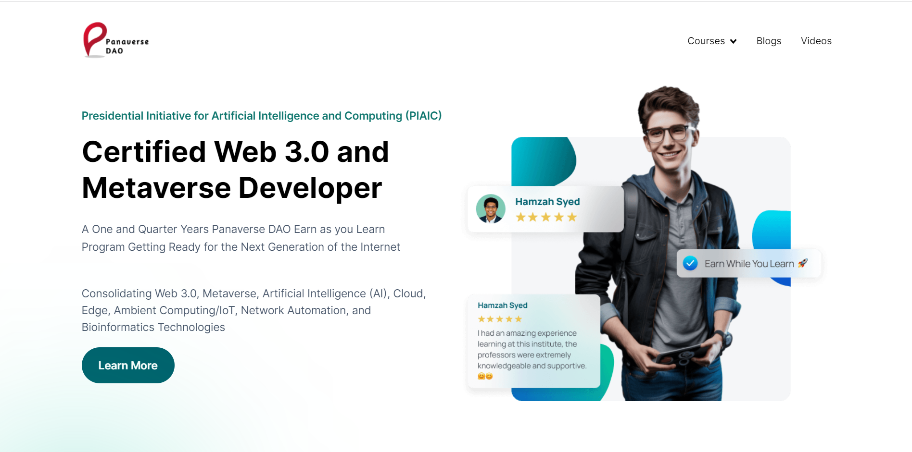
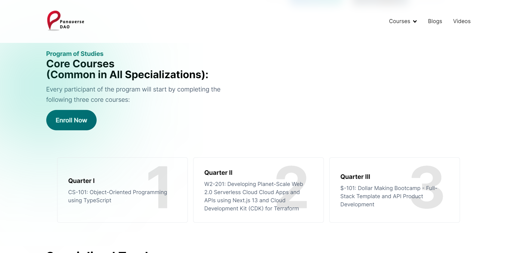
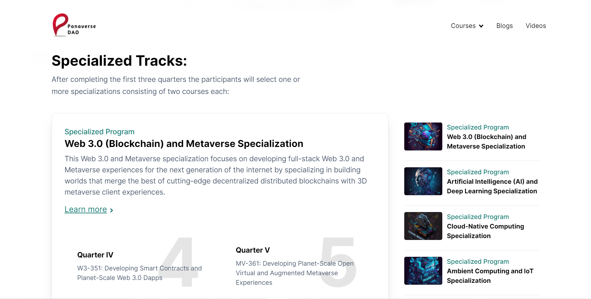
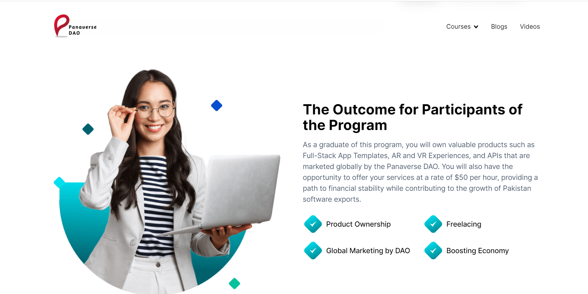

# figma design - https://www.figma.com/file/d85Qhq3DcaZaamPRmvkZ9P/Panaverse-Clone?type=design&node-id=1-23&mode=design&t=N0k3rA0iMua0gdFi-0

# website link 🔗 https://panaverse-dao-website.netlify.app/

## Images





## Mobile Responsive


## Getting Started

First, run the development server:

```bash
npm run dev
# or
yarn dev
# or
pnpm dev
```
